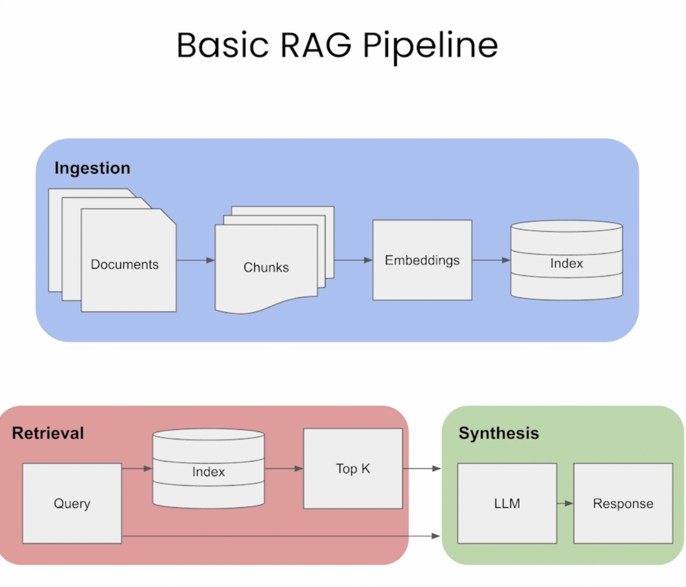

Basic RAG Pipeline consist of three steps:

1. Ingestion
2. Retrieval
3. Synthesis

[Lesson 1 Notebook](L1-Advanced_RAG_Pipeline.ipynb)

https://docs.llamaindex.ai/en/latest/examples/retrievers/auto_merging_retriever.html#
https://github.com/truera/trulens